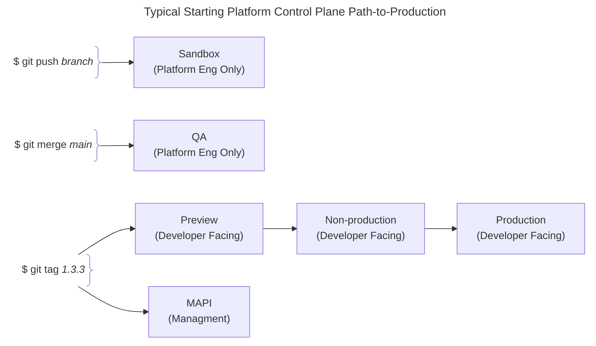
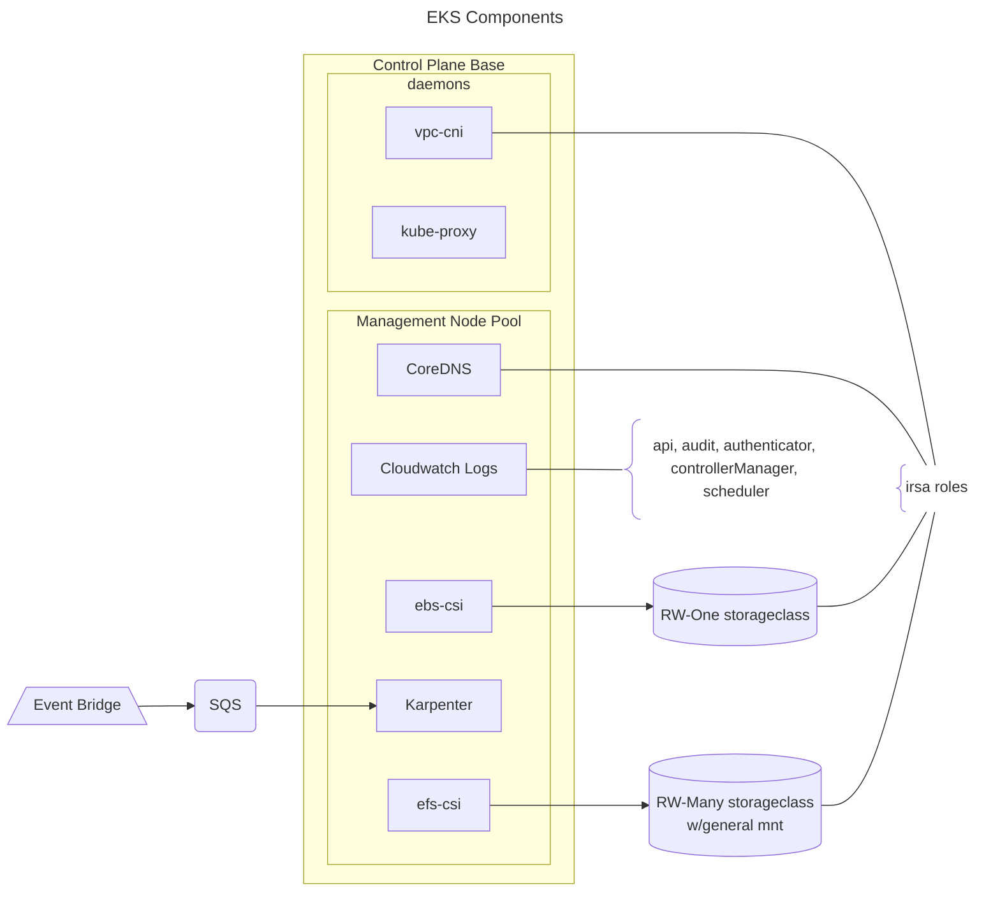
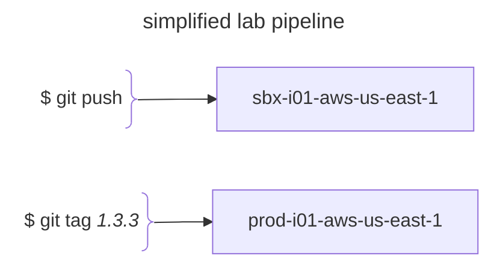

	

	
	<h2>psk-aws-control-plane-base</h2>
	 
	

This `control plane base` pipeline is effectively limited to all, and only, those components of EKS that are managed by AWS. Deployments, version changes, and removal of the associated resource belong to AWS in the shared-responsibility model of IaaS vendor managed services. The pipeline owner directs only 'when' such changes occur by specifying version changes in the environment configuration or other similar practices of notifying AWS of a change to be made.  

A typical Engineering Platform release pipeline for the underlying cluster control plane instances will have the following cluster roles, following the VPC release path:

At scale, each role may include multiple clusters. Note that the platform customer namespaces are limited to targeted roles that all amount to `production` from the platform product team's point of view.  

## AWS Managed EKS Control Plane

* control plane logging default = "api", "audit", "authenticator", "controllerManager", "scheduler"
* control plan internals encrypted using aws managed kms key
* arm-based Managed Node Group for dedicated management pool with specific toleration requirements
* eks addons:
  * vpc-cni
  * coredns
  * kube-proxy
  * aws-ebs-csi-driver
		* default storage class target provisioned, by convention = `$cluster_name-ebs-csi-storage-class`
	* aws-efs-csi-driver
		* efs file share created
		* default storage class provisioned, by convention = `$cluster_name-efs-csi-storage-class`
		* filesystem-id stored in 1password, make discoverable via platforms/clusters API
	* karpenter
		* sqs and eventbridge managed disruption events
		* arm and amd NodePools resources defined
			* target desired architecture with `kubernetes.io/arch` = "arm64" | "amd64"
* psk-system namespace created
* admin ClusterRolebinding created for twplatformlabs/platform team claim

## Authentication modes

## Lab Instances

## EKS Best Practices Guides

See [implementation notes](EKS-Best-Practices-Guides.md).  

## Maintainers

**upgrade kubernetes and addon version**  

Change `eks_version` in the environments json to initiate upgrade to new EKS version. Addons will automatically update to the correct, latest version with each pipeline run.  

**managment node group**  

The `taint` step results in the MNG nodes updating to the correct, latest patch version.  

**general data plane ndoes**  

Karpenter managed nodepools will schedule an update to the correct, latest patch version each week.  

**TODO**  

* observability solution to replace datadog not yet implemented
* eks-addons vpc-cni, ebs-csi, and efs-csi are not yet deployed using the pod identity manager method in the lastest module.
* currently the "taint" logic for refresh of management node group nodes is based on a value in the environment file. Which means that it is just on or off. The reason for this is that when creating a new cluster there are no node groups to taint so a command to do so will fail so you must set it true or false in the code based on the cluster (or cluster role if scaled). A better solution would be to have a test that can determine if the cluster does not yet exist and thereby skip the taint, successfully.

