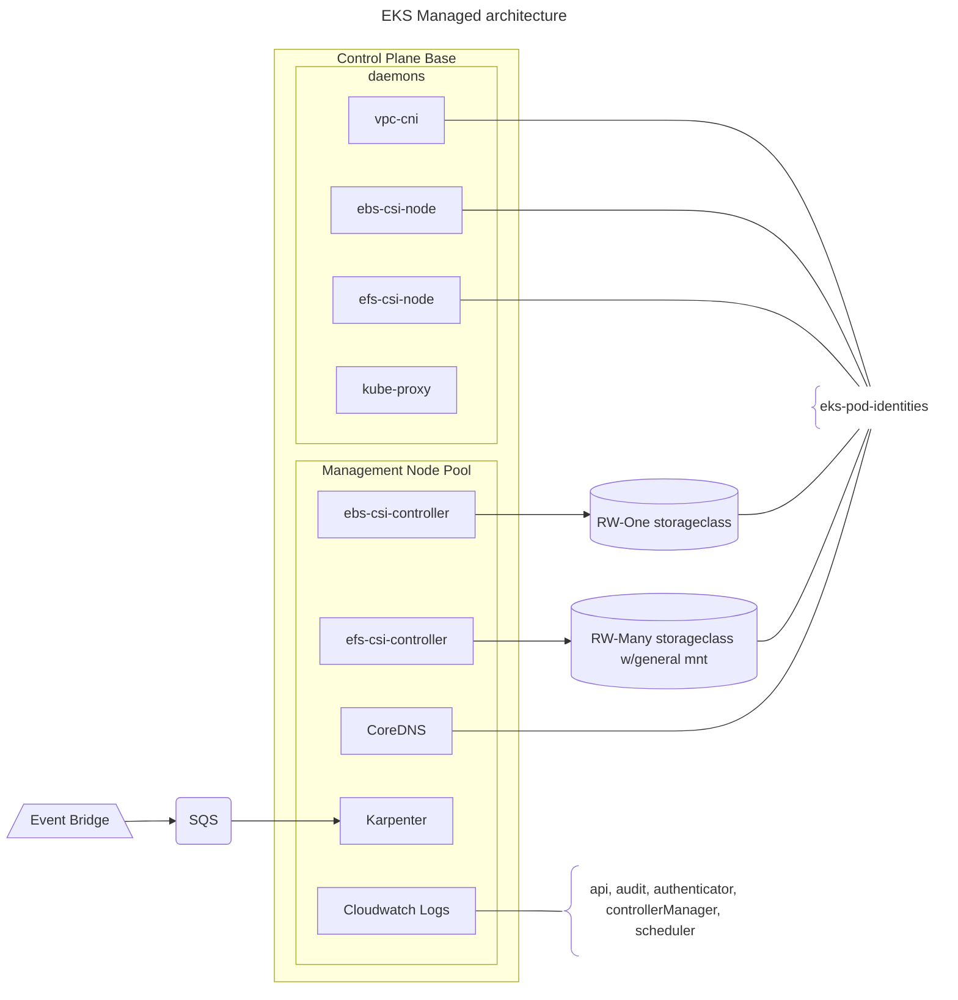
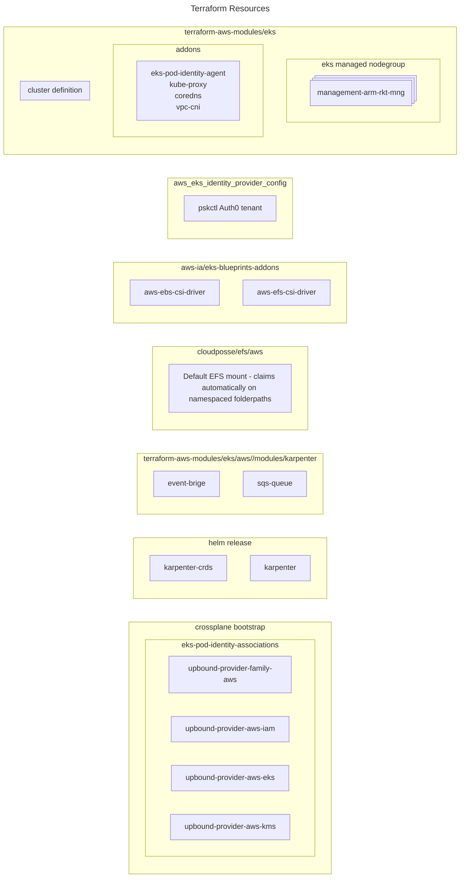
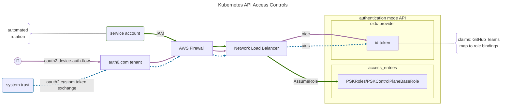
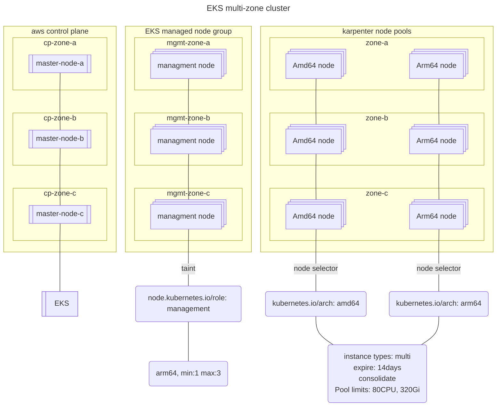

<div align="center">
	<p>
	
	<h2>psk-aws-control-plane-base</h2>
	<a href="https://opensource.org/licenses/MIT"></a> <a href="https://aws.amazon.com"></a>
	</p>
</div>

This `control plane base` pipeline is intended to be limited to all, and only, those components of EKS that are managed by AWS. Deployments, version changes, and removal of the associated resources belong to AWS in the shared-responsibility model of IaaS vendor managed services. The pipeline owner directs only 'when' such changes occur by specifying version changes in the environment configuration or other similar practices of notifying AWS of a change to be made. In addition, cautiously consider including a customization to the core EKS configuration that is part of your overall architecture and without which the Kubernetes control plane itslef would not be capable of initial communication. An example of this might be the use of an alternative CNI or the basic Karpenter install.

## AWS Managed EKS Control Plane




1. ARM Arch Managed Node Group for dedicated management pool with specific toleration requirement.

```yaml
nodeSelector:
	"node.kubernetes.io/role": "management"
tolerations:
	key: "dedicated"
	operator: "Equal"
	value: "management"
	effect: "NoSchedule"
```
2. AWS managed EKS Addons

* kube-proxy
* eks-pod-identity-agent
* vpc-cni
* coredns
* aws-ebs-csi-driver
* aws-efs-csi-driver
	* common efs target created, filesystem-id stored in 1password, make discoverable via platforms/clusters API
* karpenter
	* managed disruption events via sqs and eventbridge
	* default arm and amd NodePools resources defined
		* target desired architecture with `kubernetes.io/arch` = "arm64" | "amd64"

3. psk-system and karpenter namespaces created
4. admin ClusterRolebinding created for twplatformlabs/platform team claim
5. aws_eks_pod_identity_association to PSKCrossplaneProviderRole created for aws provider bootstrap

* `upbound-provider-family-aws`
* `upbound-provider-aws-iam`
* `upbound-provider-aws-ksm`
* `upbound-provider-aws-eks`

6. cluster-info config map set to support ArgoCD Core, role-based cluster config management

## Authentication modes

## Lab Instances


A typical Engineering Platform release pipeline for the underlying cluster control plane instances will have the following cluster roles, following the VPC release path:


At scale, each role may include multiple clusters. Note that the platform customer namespaces are limited to targeted roles that all amount to `production` from the platform product team's point of view.  


## EKS Best Practices Guides

See [implementation notes](doc/Essential-EKS-Best-Practices-Reference.md).  
See release pipelin artifacts for kube-bench scan results in pipeline artifacts.  

## Maintainers

**Release version tag based on Kubernetes version**  

The semantic tag  convention for the control_plane_base pipeline is to set the major and minor based on the kubernetes version. The patch octet is used for each additional incremental update.  

Example: The initial upgrade release tag for kubernetes v1.34 will be 1.34.0, with 1-x for subsequent changes released between then and the Kubernetes v1.35 release.  

**upgrade kubernetes and addon version**  

Change `kubernetes_version` in the environments json to initiate upgrade to new EKS version. Addons will automatically update to the correct, latest version with each pipeline run.  

Karpenter is pinned to a value in the tfvars file. Update the version to perform the helm upgrade after reviewing the upgrade requirements. The kube-bench test is currently pinned to a Aquasec kube-bench image in the deployment manifest. Ongoing benchmark assessment is performed by the Trivy operator.   

**node lifecycles**  

Cluster services run on the ARM-based management node group. This node group uses the `use_latest_ami_release_version` setting to refresh nodes to the newest AMI on a pipeline run if one is available.  

Karpenter node pools are configured to automatically replace nodes older than 7 days.  

**TODO**  

* Moving forward with using only a simple per-cluster observability solution in order to be able to support more thorough Starterkit examples. When that is in place, should see base-specific configuration managed here.
* eks-addons vpc-cni, ebs-csi, and efs-csi don't yet have a recommended pattern for using the pod identity manager method.
* The current Module-based node lifecycle for the management group (`use_latest_ami_release_version`) only replaces nodes when newer release version are available. This averages about 2-3 weeks per release. A more secure approach is to have a scheduled run (weekly or similar) where the managed node group for a zero-downtime replacement. The Terraform `taint` command can be used to mark the group for replace with the next TF apply, and there are other potential ways as well.
